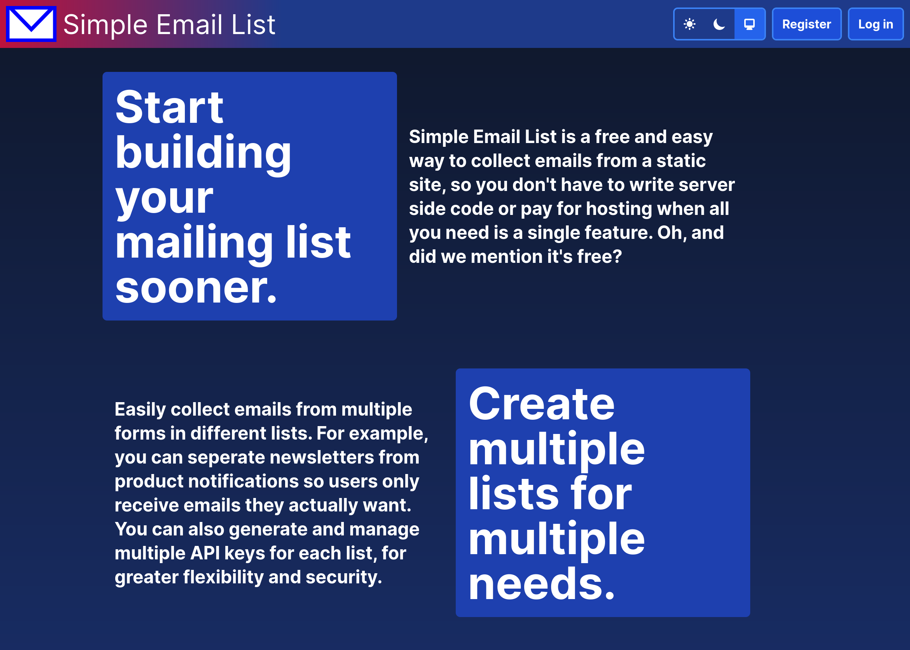
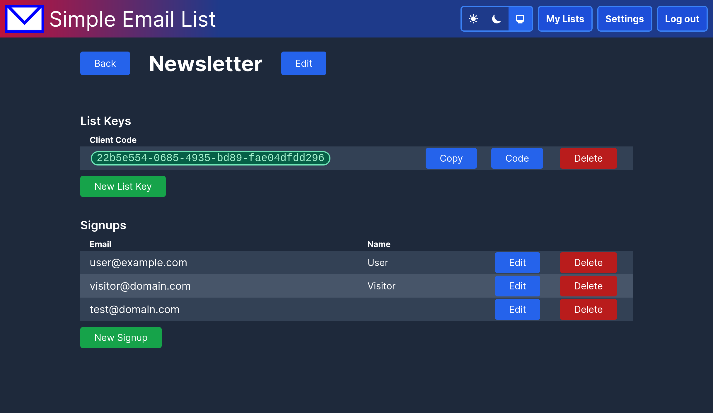
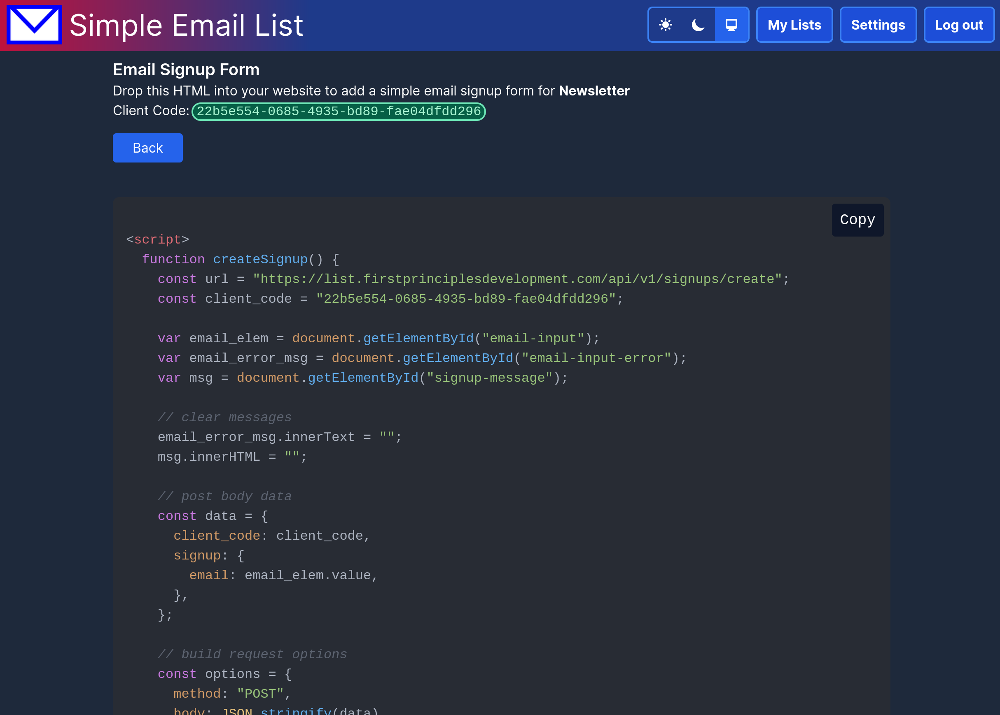

<h1 align="center">
    Simple Email List 
</h1>

  <a href="https://list.firstprinciplesdevelopment.com">Website</a> |
  <a href="#screenshots">Screenshots</a> |
  <a href="#running-locally">Running Locally</a>

## Simple Email List is an open source app to start collecting emails for a mailing list quickly. A typical use case is adding an email signup form to a static site. You can write your own code to POST emails to the API endpoint or copy and paste the HTML generated for each API key you create. It's free to use, you can register [here](https://list.firstprinciplesdevelopment.com/users/register).

## [Screenshots](screenshots)

## [Running Locally](running-locally)

- Install dependencies with `mix deps.get`
- Create and migrate your database with `mix ecto.setup`
- Start Phoenix endpoint with `mix phx.server` or inside IEx with `iex -S mix phx.server`

Now you can visit [`localhost:4000`](http://localhost:4000) from your browser.
